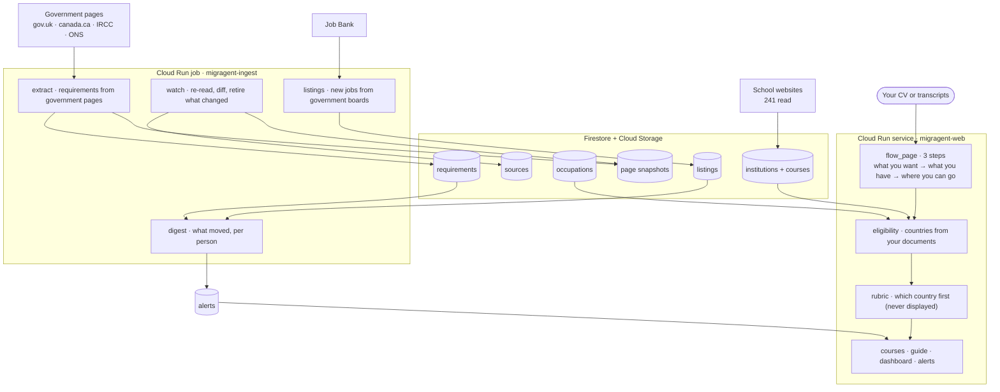

# MIGRAGENT

An agent that reads the official immigration rules every day and tells you what you need to
study or work in another country — the steps, the documents, the money, and what changed.

Live: **https://migragent.onenept.com**

Nothing it says is stated without a sentence from a government's own page behind it, with the
date that page was read. Anything it cannot show you a sentence for is thrown away before you
see it.

---

## What it does

You are not asked to pick a country. That is backwards: somebody who does not already know
Canada is short of welders cannot choose Canada for being short of welders, and asking them to
choose makes them do the research this exists to do for them.

So the order is inverted.

1. **Say what you want.** Study, work, or both.
2. **Upload what you have.** A CV, or transcripts. Photographs are fine — most people
   photograph their documents, and the text is read off the picture.
3. **The countries come out of your own documents.** A work country appears only when its
   published shortage list matches something your CV says. A study country appears only when a
   school on its official register teaches your level and subject.

Then it keeps working after you close the tab: when a rule moves, an intake opens, or a job in
a shortage occupation you qualify for is posted, you are told.

---

## What is in it, as of 22 August 2026

| | |
| --- | --- |
| Requirements read from official pages | 2,332 |
| Government pages read and re-read | 1,221 |
| Institutions on official registers | 2,065 |
| Courses read from school websites | 3,990 across 241 schools |
| Live job postings matched against CVs | 2,042 |

Study works for **Canada and the United Kingdom**. Work works for **Canada**. Six more countries
have a visa guide but no school or job data yet, and the README does not pretend otherwise —
`docs/SOURCES.md` lists what was checked and what refused.

---

## The rules it holds itself to

These are not aspirations. Each one is enforced somewhere in the code and most were learned by
getting it wrong first; `docs/DEFECTS.md` has thirty-eight of those.

**Every claim carries a quote.** A requirement, a course, a fee and an occupation each store a
verbatim span from the page, checked against that page's own text before the row is kept. Across
3,686 extracted courses, 29 were dropped for a quote that was not really there.

**The robots gate is not negotiable.** A site that disallows us is not read. A site that will not
serve robots.txt is not read either, which cost us HESA and the UK's job board. A browser is used
to render JavaScript, never to get past a policy or a bot check.

**Nothing is invented to fill a gap.** A course with no published fee is shown with no fee and a
question pointed at the school's own contact page. 3,774 of 3,990 courses carry such a question,
because that is the truth about what schools publish.

**Internal scores never reach a screen.** The rubric that decides which country to serve first is
an opinion, not a measurement, and printing it would dress an editorial choice as a finding.

**The file is never kept.** Documents are read in memory and discarded; the fields survive. The
one exception is a profile picture, which exists to be shown back to you, is resized to 256px in
your own browser before it is sent, and is deleted with everything else.

---

## Architecture



**Three identities, and the boundary between them is measured rather than asserted.**
`migragent-web` serves requests and cannot start a crawl. `migragent-researcher` reads pages and
cannot read a case. `migragent-watcher` is the only thing that can read the snapshot archive back,
because comparing today with yesterday is the one job that genuinely needs yesterday — and nothing
anywhere can become the watcher. `tools/test_isolation.py` proves it.

**Scheduled daily:** retention sweep 03:17 → watch round 04:40 → job listings 05:00 → digest 05:20.
The order matters: read the government pages, ask the boards, then tell people. Run the digest
first and it reports on yesterday.

---

## Running it

```bash
pip install -r requirements.txt
export GOOGLE_CLOUD_PROJECT=your-project
python -m migragent.app                      # the web service

MIGRAGENT_MODE=extract  python -m migragent.worker   # read a lane
MIGRAGENT_MODE=watch    python -m migragent.worker   # re-read and diff
MIGRAGENT_MODE=listings python -m migragent.worker   # new jobs
MIGRAGENT_MODE=digest   python -m migragent.worker   # tell people
```

Tests are scripts rather than a framework, and each one proves a claim the product makes:

```bash
python -m tools.test_eligibility    # countries come from evidence; the rubric behaves
python tools/test_delete.py         # deleting a case deletes every row it touched
python -m tools.test_occupations    # a quote that is not on the page is refused
python -m tools.test_alerts         # the right person is told the right thing, once
python -m tools.test_isolation      # the identity boundaries hold
python -m tools.probe_job_boards    # which government boards are readable, today
```

---

## Inherited code

This repository was started from a prior scaffold. What came from it, and what was replaced, is
recorded in `docs/INHERITED.md` rather than left for a reader to guess at. Everything in
`migragent/` and `tools/` described above was written for this build.

Third-party services: Google Cloud (Vertex AI Gemini, Cloud Vision OCR, Firestore, Cloud Run,
Cloud Storage) and GMI Cloud for one generated video clip. Wikidata is used to find school
websites and is never a source for anything shown; ONS, HESA, IRCC and Times Higher Education
appear only in internal ranking, never on a page.

---

## Where it is honest about being incomplete

- Fees exist for 146 of 3,990 courses. Universities keep tuition behind calculators.
- 25 universities — including Cambridge, Manchester and McGill — have catalogues behind search
  interfaces the crawler cannot drive, so their courses are missing.
- The UK's job board will not serve robots.txt and Australia's disallows us, so neither has jobs.
- Billing for the $7/month subscription does not exist. The page says so instead of taking a card.

`docs/DEFECTS.md` and `docs/DECISIONS.md` carry the rest.
