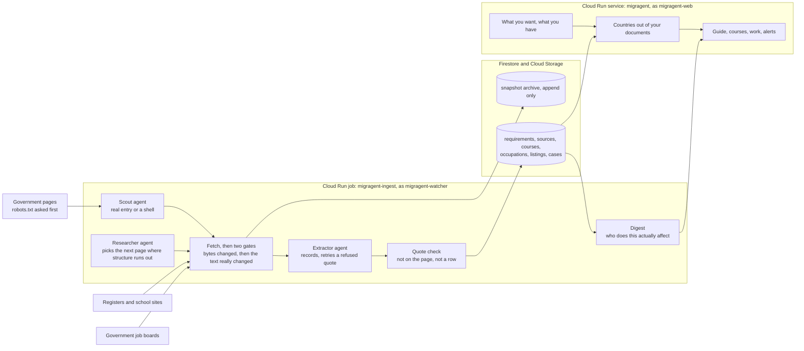

# MIGRAGENT

An agent that reads the official immigration rules every day and tells you what you need to study
or work in another country. The steps, the documents, the money, and what changed since last time.

Live at https://migragent.onenept.com. How it is built: https://migragent.onenept.com/architecture.

Nothing it says reaches you without a sentence from a government's own page behind it, and the date
that page was read. Anything it can't show you a sentence for gets thrown away before you see it.

## What it does

You are not asked to pick a country. That is backwards. Somebody who doesn't already know Canada is
short of welders can't choose Canada for being short of welders, and asking them to choose makes
them do the research this exists to do for them.

So the order is flipped.

1. Say what you want. Study, work, or both.
2. Upload what you have. A CV, or transcripts. Photos are fine, most people photograph their
   documents, and the text gets read off the picture.
3. The countries come out of your own documents. A work country shows up only when its published
   shortage list matches something your CV says. A study country shows up only when a school on its
   official register teaches your level and subject.

Then it keeps working after you close the tab. When a rule moves, an intake opens, or a job in a
shortage occupation you qualify for gets posted, you hear about it.

## What is in it, on 24 August 2026

| | |
| --- | --- |
| Live requirements read off official pages | 2,291 across 17 country and lane pairs |
| Government pages in the registry | 1,229, of which 4 are blocked |
| Institutions from official registers | 2,065 |
| Courses read from school websites | 3,990 |
| Job postings matched against CVs | 2,490 |
| Changes caught and recorded | 31 |

Study works for Canada and the United Kingdom. Work works for Canada. Several more countries have a
visa guide with no school or job data behind it yet, and `docs/SOURCES.md` says which, along with
what was checked and what refused us.

## The rules it holds itself to

Each one is enforced somewhere in the code, and most got learned by getting it wrong first.
`docs/DEFECTS.md` has forty of those, written up as failures rather than features.

Every claim carries a quote. A requirement, a course, a fee and an occupation each store a
word-for-word span from the page, checked against that page's own text before the row is allowed to
exist. Of 3,686 extracted courses, 29 were dropped for a quote that wasn't really there.

The robots gate is not negotiable. A site that disallows us doesn't get read. A site that won't
serve its robots.txt doesn't get read either, which cost us HESA and the UK's job board. A browser
renders JavaScript, it never gets past a policy or a bot check.

Nothing is invented to fill a gap. A course with no published fee shows with no fee, and a question
pointed at the school's own contact page. Fees exist for 146 of 3,990 courses, because that's the
truth about what universities publish.

Internal scores never reach a screen. The rubric that decides which country to serve first is an
opinion, not a measurement, and printing it would dress an editorial call up as a finding.

The file is never kept. Documents get read in memory and the fields survive, not the document. The
one exception is a profile picture, which exists to be shown back to you, gets resized to 256px in
your own browser before it is sent, and is deleted with everything else.

## How it is built

`docs/ARCHITECTURE.md` is the long version, and `/architecture` on the live site renders that same
file so the description and the build can't drift apart.

One Cloud Run service for every screen. One Cloud Run job that does the reading, in six modes,
started by four Cloud Scheduler jobs at 03:17, 04:40, 05:00 and 05:20 UTC. Read the government
pages, then ask the boards, then tell people.

There are four ADK agents, and an agent here means the model decides across several steps what to
do next. The Researcher picks which pages to open when the structural walk runs out of structure.
The Scout tells a real entry page from a page of links. The Extractor records requirements and
retries the ones the quote check refuses instead of dropping them. The Coverage Matcher works out
which of your documents cover which requirements, which is the readiness score. Everything else
that touches the model is a single call with a code check on the answer, so it is a call and not
an agent. Decision 12 in `docs/DECISIONS.md` has the split and why it is drawn there.



Four identities, and the boundary between them is measured, not asserted. `migragent-web` serves
requests and can't start a crawl. `migragent-researcher` reads pages and calls the model, and can't
write anything down. `migragent-writer` writes. `migragent-watcher` is the only thing that can read
the snapshot archive back, and nothing anywhere can become it, which is why its own test runs
inside the job. `tools/test_isolation.py` is where those claims get checked.

What that doesn't cover is in D39: Firestore grants read at the database, not at the collection, so
the researcher can read a case it has no business in. The product never asks it to. Nothing but the
code's own habits stops it, and the doc says so rather than describing a wall that's only a habit.

Scheduled daily: retention sweep at 03:17, watch round at 04:40, job listings at 05:00, digest at
05:20. Run the digest first and it reports on yesterday.

## Running it yourself

You need Python 3.12 and a Google Cloud project with Firestore, Cloud Storage and Vertex AI turned
on. Everything below runs from the repository root.

```bash
pip install -r requirements.txt
playwright install chromium          # the container has no browser on purpose
gcloud auth application-default login
export GOOGLE_CLOUD_PROJECT=your-project-id
```

Create the four service accounts, then apply the permission model:

```bash
for sa in researcher writer watcher web; do
  gcloud iam service-accounts create migragent-$sa --project "$GOOGLE_CLOUD_PROJECT"
done
bash tools/grant_roles.sh            # every role in one readable file, with its reason
python tools/test_isolation.py       # then prove the roles are what the file says
```

Serve it:

```bash
python -m migragent.app              # http://localhost:8080
```

An empty project shows you an empty product, so seed something to read and then read it:

```bash
python -m tools.seed_registry                                 # the entry pages, per country and lane
python -m tools.run_round UK study --mode extract --limit 5   # fetch, extract, check every quote, store
python tools/build_guide.py UK study                          # an HTML guide and a PDF, into out/
```

One thing to change before any of that: `tools/grant_roles.sh` and most files under `tools/` carry
this deployment's project id as a constant near the top. The service reads `GOOGLE_CLOUD_PROJECT`
from the environment, the tools don't, and that's a known rough edge rather than a hidden one.

The batch side is one program with six modes, run as a Cloud Run job in production and as a script
anywhere:

```bash
MIGRAGENT_MODE=extract  python -m migragent.worker   # read pages nobody has read
MIGRAGENT_MODE=watch    python -m migragent.worker   # re-read, diff, record what moved
MIGRAGENT_MODE=listings python -m migragent.worker   # new jobs off government boards
MIGRAGENT_MODE=digest   python -m migragent.worker   # work out who needs telling
MIGRAGENT_MODE=selftest python -m migragent.worker   # the watcher's own boundary
MIGRAGENT_MODE=robots   python -m migragent.worker   # print robots.txt as the job receives it
```

An unknown mode exits rather than falling through to the most expensive branch available. That
sentence is there because of D38, where an old image met a new mode and started crawling a country.

The agent layer is off by default and each piece has its own switch: `--agent` on `run_round`,
`--agent-extract`, `--lane-check`, `MIGRAGENT_AGENT_SCOUT` on `seed_registry`,
`MIGRAGENT_AGENT_COVERAGE` on the web service. Each one ships behind a flag and turns on lane by
lane, after the round has run clean twice.

## The tests, and what each one is for

They are scripts, not a framework, and each proves a claim the product makes out loud.

```bash
python -m tools.test_eligibility    # countries come from evidence, and the rubric behaves
python tools/test_delete.py         # deleting a case really does delete every row it touched
python -m tools.test_occupations    # a quote that is not on the page is refused
python -m tools.test_alerts         # the right person is told the right thing, once
python -m tools.test_agent          # the ADK researcher never opens its own model client
python -m tools.test_scout_agent    # the Scout keeps only pages that state a requirement
python -m tools.test_extractor_agent  # the Extractor retries a refused quote, never invents one
python -m tools.test_coverage_agent   # a match on a field nobody uploaded is refused
python -m tools.test_lane_check     # a page's lane is read off the page, not inherited
python tools/test_isolation.py      # the identity boundaries hold
python -m tools.test_run            # the run reports every step, and files its own time honestly
python -m tools.probe_job_boards    # which government boards are readable today
```

## Pre-existing code, and outside services

This repository was started from a prior scaffold of the author's own. `migragent/identity.py` and
`migragent/config.py` came from it and were written on 17 August 2026. `docs/INHERITED.md` records
what came across and what was replaced. Everything else under `migragent/` and `tools/` was written
for this build.

Outside services: Google Cloud for all of it, which is Vertex AI Gemini, Cloud Vision OCR,
Firestore, Cloud Run, Cloud Storage and Cloud Scheduler, plus GMI Cloud for one generated video
clip, because every Veo model returns 404 on this project. Wikidata is used to find school websites
and is never a source for anything shown. ONS, HESA, IRCC and Times Higher Education appear only in
internal ranking and never on a page.

## Where it is incomplete, said plainly

Fees exist for 146 of 3,990 courses, because universities keep tuition behind calculators.

Twenty-five universities, Cambridge and Manchester and McGill among them, publish their catalogues
behind search interfaces the crawler can't drive, so their courses are missing.

The UK's job board won't serve robots.txt and Australia's disallows us, so neither has jobs here.

Sign-in doesn't exist yet, so a case belongs to a browser rather than to a person.

Billing for the subscription doesn't exist. The page says so instead of taking a card.

`docs/DEFECTS.md` and `docs/DECISIONS.md` carry the rest, including the ones that were embarrassing.
