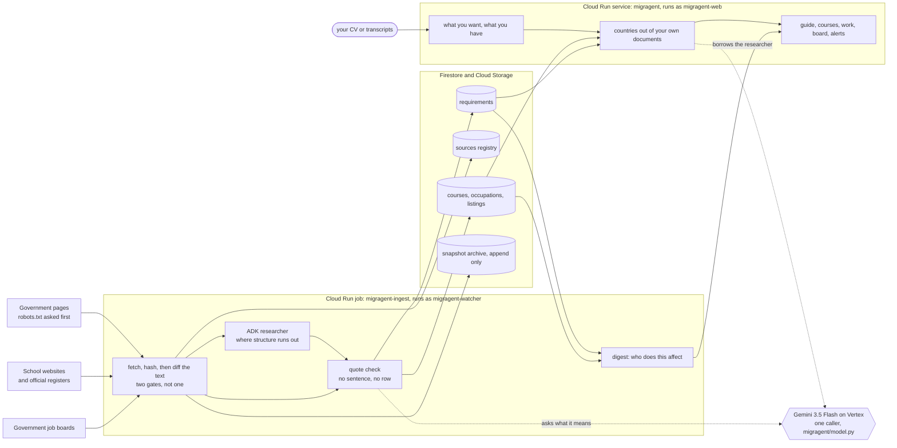

# How MIGRAGENT is put together

One web service, one batch job, four alarm clocks, and a rule that nothing gets written down
without a sentence from the page it came from.

That rule is the reason for most of the shape below. If a claim has to carry a quote, then the
thing that fetched the page and the thing that decided what the page means cannot be the same
thing, and neither of them can be trusted to remember the URL. So the fetch keeps the URL and the
date, the model gets the text and nothing else, and the two are put back together by code that
checks the quote is really on the page before the row exists.

## What is actually running

A Cloud Run service called `migragent` serves every screen. It is Flask behind gunicorn, one
container, and it does the work of a request inside the request. There is no queue and no worker
pool, because a person waiting on their guide is watching a progress line, not a spinner, and
server-sent events carry it.

A Cloud Run job called `migragent-ingest` does the reading. Ten tasks, five at a time, and the
task index picks the lane. It is one program with five modes:

- `extract` reads pages nobody has read yet
- `watch` re-reads pages we have read and works out what moved
- `listings` pulls new postings off government job boards
- `digest` works out who needs telling, and tells them
- `selftest` proves the watcher can add to the snapshot archive and cannot rewrite it

Four Cloud Scheduler jobs start those, in this order and for this reason:

| Time (UTC) | What runs |
| --- | --- |
| 03:17 | retention sweep, deleting what is past its window |
| 04:40 | watch round |
| 05:00 | job listings |
| 05:20 | digest |

Read the government pages first, then ask the boards, then tell people. Run the digest first and
it reports on yesterday.

## The path one sentence takes

Say Canada moves the money a student has to show. Here is every step between that edit and it
reaching somebody.

The watch round fetches the page. Before it does, it asks the site's own robots.txt, and it asks
as itself rather than as a library, because a server that answers 403 to `Python-urllib` will
answer 404 to a client that says who it is, and 404 means there is no robots file and no rule to
break. That was D24.

The fetch comes back and gets hashed. If the bytes match yesterday, stop. That gate used to be the
only gate, and it was enough for Canada and useless for the UK, where the same unchanged page
hashes differently from a container than from a laptop. So there is a second gate: read the stored
version, diff the text, and if not one line moved then nothing moved whatever the bytes say. That
is D23, and it is the difference between a watch round costing pennies and costing what a first
read costs, every day, forever.

Something did move, so the diff is computed with difflib. Plain code, not the model. A measurement
a model performs is one nobody else can repeat.

Now the model gets asked one question: what does this change mean, in a sentence. Its answer is
stored labelled `summary_by: model`, so nobody later mistakes it for something a government wrote.

The new requirement carries a verbatim span from the page. Before the row can exist, that span is
checked against the page text we just fetched. Invented sentences fail. A real sentence with one
number changed fails. Two real fragments stitched together fail. All three were tested by writing
them and watching them get refused.

The old requirement is not deleted. It is retired with the date it stopped being true, kept for
the record, and never told to anybody again.

Then the digest looks for people whose guide leans on that requirement, and tells them. Nobody who
does not have it in their guide hears anything, because a general country watch screen is a
directory and this product does not have one.

## Who is allowed to touch what

Four identities, and the boundary between them is tested rather than asserted.

`migragent-web` serves requests. It cannot start a crawl, and it holds no model permission of its
own. When a screen needs a document read, it borrows the researcher for that call.

`migragent-researcher` reads pages and calls the model. It cannot write anything down. Try to make
it write to Firestore and it gets a 403, while the writer can write, and that second half is what
makes the first half evidence instead of a hopeful docstring.

It can read, though, and that includes cases. Firestore grants read access to a database rather
than to a collection, so `roles/datastore.viewer` covers the registry it needs and the cases it has
no business in. The product never asks it for one. Nothing stops it either, and this document is
not going to describe a wall that is only a habit. D39 has the options.

`migragent-writer` writes what was extracted.

`migragent-watcher` is the only thing that can read the snapshot archive back, because comparing
today with yesterday is the one job that genuinely needs yesterday. It can list, read and add. It
gets a 403 on overwrite and on delete, so the archive holds versions of a page rather than
readings of it. Nothing anywhere can become the watcher, which is why that test runs inside the
job instead of on a laptop.

`tools/test_isolation.py` is where those claims are checked. It once passed while proving nothing,
which is D5, and it is written the way it is now because of that.

Two identities exist that are not part of the product. `migragent-scheduler` can start the round
and do nothing else. `migragent-deployer` can deploy the service and has no Firestore access at
all, so the pipeline that ships the app cannot read a case.

## Where the model is allowed, and where it is not

Every call goes through `migragent/model.py`. One caller, one retry policy, one error that says
what actually happened. Five places used to each keep their own copy of the same twenty lines and
none of them retried, so one rate limit produced three symptoms that looked like three different
bugs. That is D20.

The model reads documents, extracts requirements, reads CVs, scores a CV against a posting,
drafts letters, and writes the one sentence about what a change means. It never decides that a
requirement exists, it never supplies a URL, and it never sees the date a page was read. Those
come off the fetch, which is the only thing that knows them.

The researcher is on ADK. `migragent/researcher.py` is an `LlmAgent` with five tools: read a page,
list what a page links to, record a requirement, note an open question, finish. It cannot fetch,
it can only ask a tool that checks robots.txt first. It cannot write a requirement, it can only
offer one to a tool that checks the quote. Refusals are counted and returned rather than swallowed.

ADK's own model client is not used. `migragent/agent_llm.py` is a `BaseLlm` that routes everything
back through `model.py`, so the agent gets the same retries and the same status codes as every
other caller. `tools/test_agent.py` traps `google.genai.Client` and fails loudly if that ever stops
being true.

The agent does not run the daily round, and Decision 10 has the numbers. On a lane the walk covers
deeply it read 3 pages against the walk's 19 and returned 26 requirements against 174, though 10
of those 26 were things the walk had missed, including the fees. On a thin lane it read 7 pages,
returned more than the walk, and 4 of its pages were not in the registry at all. So it runs where
structure has run out, and the walk keeps the lanes where structure is doing the work.

## What is stored

Firestore holds the rows: sources, requirements, occupations, institutions, courses, listings,
changes, cases, alerts. Cloud Storage holds the raw page snapshots, append only.

The registry is data rather than code. Source number 1,230 is a row, not a deploy. That is what
makes a source count a real number instead of a marketing one.

As of 24 August 2026 that is 1,229 sources with 4 of them blocked, 2,291 live requirements across
17 country and lane pairs, 2,065 institutions off official registers, 3,990 courses read from
school websites, 2,490 job postings, and 31 recorded changes.

## The picture

## How it gets deployed

Push to `main` and GitHub Actions builds it and deploys it, then calls `/health` on the new
revision and fails the job if it does not answer. Authentication is Workload Identity Federation,
so there is no service account key anywhere, in the repo or in a secret.

One thing worth knowing if you set this up yourself: the first run after you write the identity
binding can fail with a 403 on `iam.serviceAccounts.getAccessToken` about a minute later. Nothing
is wrong with the binding. IAM has not propagated. Wait and re-run before you go looking for a
mistake in it.

## What this deliberately does not use

Pub/Sub was in the plan and then taken out, because it was carrying an integer that Cloud Run
already hands every task. A topic with one publisher and one subscriber is a service added to be
seen. Decision 4 has the reasoning.

There is no search box anywhere in the product, and no chat. The whole point is that somebody who
does not already know what to look for gets an answer, and a search box asks them to already know.

There is no vector database. Matching a person to a change is done on the requirement rows they
already carry, which is an exact lookup, and dressing it up as a similarity problem would make it
slower and less certain at the same time.
